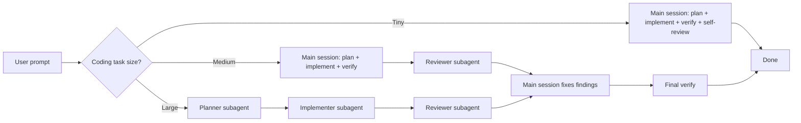
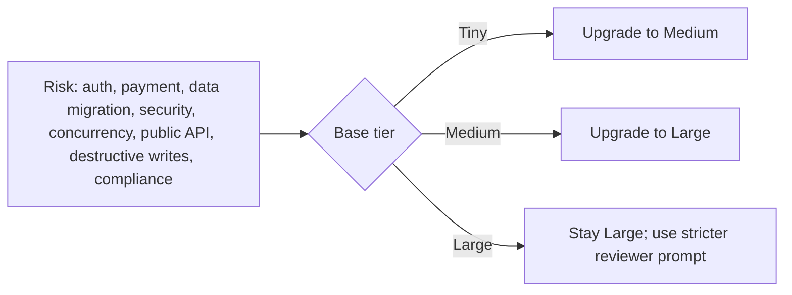
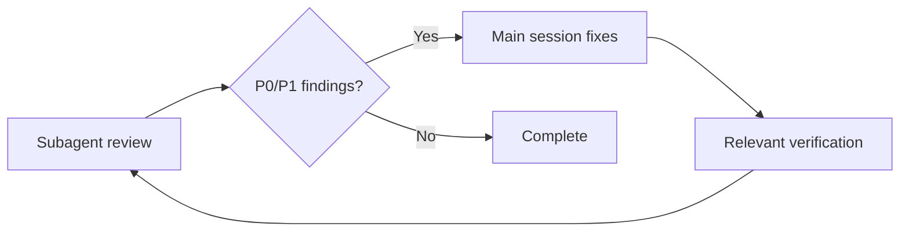

# 🪦 Light RIP

Light RIP is an agent skill package, not a software application.

`RIP` names the three safeguards in the skill: `Review`, `Implement`, and `Plan`. In execution, the lightweight loop runs as `Plan -> Implement -> Review`; the name keeps the three pieces memorable without turning them into a heavyweight process.

Light RIP has exactly three tiers:

- `Tiny`: the main session plans, implements, verifies, and self-reviews. No subagents.
- `Medium`: the main session plans, implements, and verifies, then a reviewer subagent reviews the diff. The main session fixes review findings.
- `Large`: planner, implementer, and reviewer are all subagents. The main session coordinates and fixes review findings.



Risk upgrades the tier:



Review findings always return to the main session:



## Installation

Do not install it as an app, service, Python package, or normal project checkout. Install it by placing the `light-rip` folder in your agent's skills directory, then mount the required `UserPromptSubmit` reminder hook.

Installation is incomplete until the hook is mounted.

### Claude Code

Claude Code documentation and community examples use `$HOME/.claude/skills` or `~/.claude/skills`. Claude Code does not define a standard `$CLAUDE_HOME` variable.

Clone directly into the Claude Code skills directory, then run the required hook setup from that installed copy:

```bash
mkdir -p "$HOME/.claude/skills"
git clone https://github.com/x1han/light-rip "$HOME/.claude/skills/light-rip"
cd "$HOME/.claude/skills/light-rip"
python hooks/install_claude_hook.py
```

This writes or updates:

- `~/.claude/settings.json`

Restart Claude Code after installing or updating the skill.

### Codex

Clone directly into the Codex skills directory, then run the required hook setup from that installed copy:

```bash
mkdir -p "$CODEX_HOME/skills"
git clone https://github.com/x1han/light-rip "$CODEX_HOME/skills/light-rip"
cd "$CODEX_HOME/skills/light-rip"
python hooks/install_codex_hook.py
```

This writes or updates:

- `$CODEX_HOME/hooks.json`
- `$CODEX_HOME/config.toml`, ensuring `[features] hooks = true`

Restart Codex after installing or updating the skill.

## What The Hook Does

The hook runs on `UserPromptSubmit`. It does not block prompts.

For likely coding requests, it injects `reminder.md` as additional context so the agent remembers:

- tiny tasks stay in the main session and do not spawn subagents
- medium tasks must spawn one reviewer subagent
- large tasks must spawn planner, implementer, and reviewer subagents
- risky tasks upgrade one tier

For non-coding prompts, it stays quiet.

## Files

- `SKILL.md`: the skill instructions
- `reminder.md`: the context injected by the hook
- `hooks/light_rip_reminder.py`: the shared hook command
- `hooks/install_codex_hook.py`: Codex hook setup
- `hooks/install_claude_hook.py`: Claude Code hook setup
