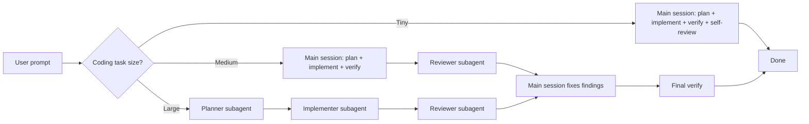
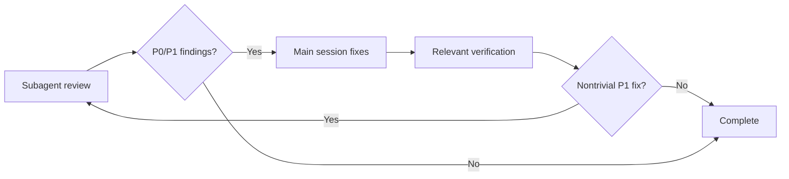

# 🪦 Light RIP

Light RIP is an agent skill package, not a software application.

`RIP` names the three safeguards in the skill: `Review`, `Implement`, and `Plan`. In execution, the lightweight loop runs as `Plan -> Implement -> Review`; the name keeps the three pieces memorable without turning them into a heavyweight process.

Light RIP has exactly three tiers:

- `Tiny`: the main session plans, implements, verifies, and self-reviews. No subagents.
- `Medium`: the main session plans, implements, and verifies, then a reviewer subagent reviews the diff. The main session fixes review findings.
- `Large`: planner, implementer, and reviewer are all subagents. The main session coordinates and fixes review findings.


```mermaid
flowchart LR
    A["User prompt"] --> B{"Coding task size?"}
    B -->|"Tiny"| C["Main session: plan + implement + verify + self-review"]
    B -->|"Medium"| D["Main session: plan + implement + verify"]
    D --> E["Reviewer subagent"]
    B -->|"Large"| F["Planner subagent"]
    F --> G["Implementer subagent"]
    G --> H["Reviewer subagent"]
    E --> I["Main session fixes findings"]
    H --> I
    C --> J["Done"]
    I --> K["Final verify"]
    K --> J
```

Risk upgrades the tier: risky tiny becomes medium, risky medium becomes large, and risky large stays large while reviewers focus on the risk area.

Review findings always return to the main session. For nontrivial P1 fixes, do one short reviewer subagent re-review of the changed lines.


```mermaid
flowchart LR
    A["Subagent review"] --> B{"P0/P1 findings?"}
    B -->|"Yes"| C["Main session fixes"]
    C --> D["Relevant verification"]
    D --> E{"Nontrivial P1 fix?"}
    E -->|"Yes"| A
    E -->|"No"| F["Complete"]
    B -->|"No"| F
```

## Installation

Do not install it as an app, service, Python package, or normal project checkout. Install it by placing the `light-rip` folder in your agent's skills directory, then mount the required `UserPromptSubmit` reminder hook.

Installation is incomplete until the hook is mounted.

### Claude Code

Claude Code documentation and community examples use `$HOME/.claude/skills` or `~/.claude/skills`. Claude Code does not define a standard `$CLAUDE_HOME` variable.

Clone directly into the Claude Code skills directory, then run the required hook setup from that installed copy:

```bash
mkdir -p "$HOME/.claude/skills"
git clone https://github.com/x1han/light-rip "$HOME/.claude/skills/light-rip"
cd "$HOME/.claude/skills/light-rip"
python hooks/install_claude_hook.py
```

This writes or updates:

- `~/.claude/settings.json`

Restart Claude Code after installing or updating the skill.

### Codex

If `CODEX_HOME` is unset, Codex normally uses `$HOME/.codex`.

Clone directly into the Codex skills directory, then run the required hook setup from that installed copy:

```bash
CODEX_HOME="${CODEX_HOME:-$HOME/.codex}"
mkdir -p "$CODEX_HOME/skills"
git clone https://github.com/x1han/light-rip "$CODEX_HOME/skills/light-rip"
cd "$CODEX_HOME/skills/light-rip"
python hooks/install_codex_hook.py
```

This writes or updates:

- `$CODEX_HOME/hooks.json`
- `$CODEX_HOME/config.toml`, ensuring `[features] hooks = true`

Restart Codex after installing or updating the skill.

### Other Agents (Mavis / Mavis Code, and beyond)

For any agent runtime that is not Claude Code or Codex, use the general installer. Defaults target Mavis / Mavis Code (the primary "other agent" use case); override flags to install for any runtime that uses the same hook-file convention.

```bash
# clone into any local directory; the installer handles the rest
git clone https://github.com/x1han/light-rip
cd light-rip
python hooks/install_general_agent_hook.py
```

This writes or updates:

- `<dataDir>/agents/<agent>/hooks/light-rip-reminder.md` (default agent: `mavis`)

Useful flags:

- `--agent <name>` — target agent name (default: `mavis`)
- `--data-dir <path>` — override the agent data dir (default: `$MAVIS_DATA_DIR` or `~/.mavis`)
- `--hooks-dir <path>` — write the hook file to a specific directory directly (skips data-dir resolution)
- `--format <name>` — reminder output format: `mavis` (default) or `harness`
- `--event <name>` — hook event (default: `UserPromptSubmit`)
- `--priority <n>` — hook priority (lower runs first; default 5)
- `--no-path-fix` — skip the Git-Bash PATH auto-fix described below

The shared `light_rip_reminder.py` dispatches on `--format` and currently supports `harness` (Claude Code / Codex shape — back-compat default) and `mavis` (Mavis / Mavis Code shape). Adding a new agent = adding one entry to the `FORMATS` table in `light_rip_reminder.py`; no need to touch this installer.

#### Windows: Git Bash PATH

The Mavis hook runner executes the body of a fenced `bash` block through `sh` on Windows. Git for Windows ships `sh.exe` at `C:\Program Files\Git\bin\sh.exe`, but it is not on `PATH` by default. The installer detects this and appends Git Bash to the user's `PATH` via the registry (with a `SendMessageTimeout` broadcast so new processes pick it up immediately).

The currently running Mavis daemon keeps the PATH it was launched with. **Restart the agent runtime** after installing so the new PATH takes effect for the hook runner.

If you prefer to manage PATH yourself, pass `--no-path-fix` and ensure `sh` is on the runtime's PATH before installing.

Restart the agent runtime after installing or updating the skill.

## Hook Behavior

The required `UserPromptSubmit` hook is non-blocking. For every prompt, it injects `reminder.md` as additional context so the agent remembers:

- factual claims need current evidence
- observations, inferences, and recommendations should stay separate
- tiny code edits do not need Light RIP
- medium and large coding tasks should use Light RIP
- risky tasks should use the stronger review path

## Files

- `SKILL.md`: the skill instructions
- `reminder.md`: the context injected by the hook
- `hooks/light_rip_reminder.py`: the shared hook command. Multi-format via `--format` (default `harness` keeps Claude Code / Codex back-compat; `mavis` rewrites the prompt for Mavis / Mavis Code). New runtimes plug in by adding an entry to `FORMATS`.
- `hooks/install_codex_hook.py`: Codex-specific installer (calls `light_rip_reminder.py` with no flags, defaults to `harness`)
- `hooks/install_claude_hook.py`: Claude Code-specific installer (same call shape)
- `hooks/install_general_agent_hook.py`: generic installer for any other agent runtime (defaults to Mavis; calls `light_rip_reminder.py --format mavis`)
