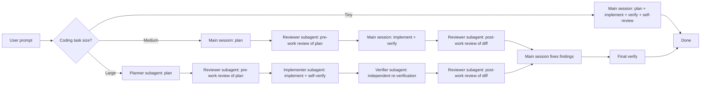
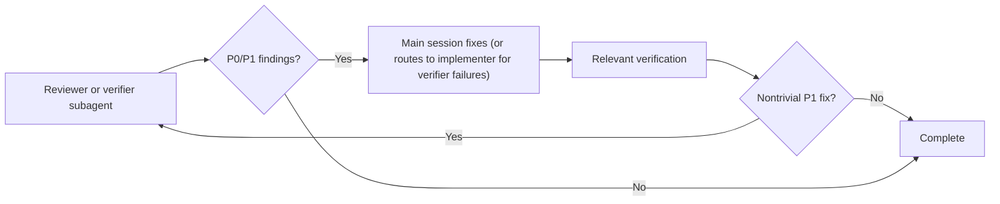

# 🪦 Light RIP

Light RIP is an agent skill package, not a software application.

`RIP` names the three safeguards in the skill: `Review`, `Implement`, and `Plan`. In execution, the lightweight loop runs as `Plan -> Implement -> Review`; the name keeps the three pieces memorable without turning them into a heavyweight process.

Light RIP has exactly three tiers. Every tier runs `Plan -> Implement -> Verify`. Medium and Large add two independent reviewer passes — one before any code is written (pre-work review) and one after the diff exists (post-work review) — so design errors get caught cheaply before they are baked into code. Large also adds an independent verifier subagent that re-runs the verification commands with fresh eyes.

- `Tiny`: the main session plans, implements, verifies, and self-reviews. No subagents.
- `Medium`: the main session plans inline. A reviewer subagent does a pre-work review of the plan. The main session implements and verifies. The reviewer subagent (or a fresh one) does a post-work review of the diff. The main session fixes review findings.
- `Large`: a planner subagent produces the plan. A reviewer subagent does a pre-work review of the plan. An implementer subagent implements and self-verifies. A verifier subagent independently re-runs the verification commands with fresh eyes. The reviewer subagent (or a fresh one) does a post-work review of the diff and verification output. The main session coordinates and fixes review findings.


```mermaid
flowchart LR
    A["User prompt"] --> B{"Coding task size?"}
    B -->|"Tiny"| C["Main session: plan + implement + verify + self-review"]
    B -->|"Medium"| D["Main session: plan"]
    D --> E1["Reviewer subagent: pre-work review of plan"]
    E1 --> F["Main session: implement + verify"]
    F --> G1["Reviewer subagent: post-work review of diff"]
    B -->|"Large"| H["Planner subagent: plan"]
    H --> I1["Reviewer subagent: pre-work review of plan"]
    I1 --> J["Implementer subagent: implement + self-verify"]
    J --> J2["Verifier subagent: independent re-verification"]
    J2 --> K1["Reviewer subagent: post-work review of diff"]
    G1 --> L["Main session fixes findings"]
    K1 --> L
    C --> M["Done"]
    L --> N["Final verify"]
    N --> M
```

## Reviewer and Verifier Roles

Light RIP uses three independent subagent roles in Medium and Large:

- **Pre-work reviewer**: scrutinizes the plan before any code is written. Catches wrong target files, wrong abstractions, missing verification, and misread requirements — design errors that are cheap to fix before implementation and expensive to fix after.
- **Implementer** (Large only as a subagent): does the work and runs the planned verification commands itself.
- **Verifier** (Large only): independently re-runs the verification commands with fresh eyes. Catches cases where the implementer's self-verification was inadequate, where the chosen verification commands miss regressions, or where edge cases were not exercised. The verifier reports whether the implementation actually passes the planned checks.
- **Post-work reviewer**: scrutinizes the diff and verification output after implementation. For Large, it sees both the implementer's report and the verifier's independent report. Catches bugs, regressions, transcript contamination, and risky overengineering.

Pre-work review protects the implementation phase from going down a wrong path. Post-work review protects the final result from going out the door. The verifier protects against single-sourced verification — the implementer's self-report being the only signal that the code works.

Pre-work review and post-work review are both done by a reviewer subagent, but they have different inputs and different concerns. They cannot be merged into a single pass.

The verifier is not a replacement for the implementer's self-verification, and it is not a replacement for the post-work reviewer. It is a separate role with a separate job: it executes verification commands and reports results. Reviewer reads verification output; verifier produces verification output.

Risk upgrades the tier: risky tiny becomes medium, risky medium becomes large, and risky large stays large while reviewers focus on the risk area.

Reviewer and verifier findings both return to the main session. The same fix loop applies to pre-work review, post-work review, and the Large verifier: P0/P1 findings block completion, main session fixes or routes back to the implementer, relevant verification runs again, and nontrivial P1 fixes get a short re-review. For verifier failures, the loop routes through the implementer (fix + self-verify + verifier re-run); for reviewer findings, main session fixes directly.


```mermaid
flowchart LR
    A["Reviewer or verifier subagent"] --> B{"P0/P1 findings?"}
    B -->|"Yes"| C["Main session fixes (or routes to implementer for verifier failures)"]
    C --> D["Relevant verification"]
    D --> E{"Nontrivial P1 fix?"}
    E -->|"Yes"| A
    E -->|"No"| F["Complete"]
    B -->|"No"| F
```

## Installation

Do not install it as an app, service, Python package, or normal project checkout. Install it by placing the `light-rip` folder in your agent's skills directory, then mount the required `UserPromptSubmit` reminder hook.

Installation is incomplete until the hook is mounted.

### Claude Code

Claude Code documentation and community examples use `$HOME/.claude/skills` or `~/.claude/skills`. Claude Code does not define a standard `$CLAUDE_HOME` variable.

Clone directly into the Claude Code skills directory, then run the required hook setup from that installed copy:

```bash
mkdir -p "$HOME/.claude/skills"
git clone https://github.com/x1han/light-rip "$HOME/.claude/skills/light-rip"
cd "$HOME/.claude/skills/light-rip"
python hooks/install_claude_hook.py
```

This writes or updates:

- `~/.claude/settings.json`

Restart Claude Code after installing or updating the skill.

### Codex

If `CODEX_HOME` is unset, Codex normally uses `$HOME/.codex`.

Clone directly into the Codex skills directory, then run the required hook setup from that installed copy:

```bash
CODEX_HOME="${CODEX_HOME:-$HOME/.codex}"
mkdir -p "$CODEX_HOME/skills"
git clone https://github.com/x1han/light-rip "$CODEX_HOME/skills/light-rip"
cd "$CODEX_HOME/skills/light-rip"
python hooks/install_codex_hook.py
```

This writes or updates:

- `$CODEX_HOME/hooks.json`
- `$CODEX_HOME/config.toml`, ensuring `[features] hooks = true`

Restart Codex after installing or updating the skill.

### Other Agents (Mavis / Mavis Code, and beyond)

For any agent runtime that is not Claude Code or Codex, use the general installer. Defaults target Mavis / Mavis Code (the primary "other agent" use case); override flags to install for any runtime that uses the same hook-file convention.

```bash
# clone into any local directory; the installer handles the rest
git clone https://github.com/x1han/light-rip
cd light-rip
python hooks/install_general_agent_hook.py
```

This writes or updates:

- `<dataDir>/agents/<agent>/hooks/light-rip-reminder.md` (default agent: `mavis`)

Useful flags:

- `--agent <name>` — target agent name (default: `mavis`)
- `--data-dir <path>` — override the agent data dir (default: `$MAVIS_DATA_DIR` or `~/.mavis`)
- `--hooks-dir <path>` — write the hook file to a specific directory directly (skips data-dir resolution)
- `--format <name>` — reminder output format: `mavis` (default) or `harness`
- `--event <name>` — hook event (default: `UserPromptSubmit`)
- `--priority <n>` — hook priority (lower runs first; default 5)
- `--no-path-fix` — skip the Git-Bash PATH auto-fix described below

The shared `light_rip_reminder.py` dispatches on `--format` and currently supports `harness` (Claude Code / Codex shape — back-compat default) and `mavis` (Mavis / Mavis Code shape). Adding a new agent = adding one entry to the `FORMATS` table in `light_rip_reminder.py`; no need to touch this installer.

#### Windows: Git Bash PATH

The Mavis hook runner executes the body of a fenced `bash` block through `sh` on Windows. Git for Windows ships `sh.exe` at `C:\Program Files\Git\bin\sh.exe`, but it is not on `PATH` by default. The installer detects this and appends Git Bash to the user's `PATH` via the registry (with a `SendMessageTimeout` broadcast so new processes pick it up immediately).

The currently running Mavis daemon keeps the PATH it was launched with. **Restart the agent runtime** after installing so the new PATH takes effect for the hook runner.

If you prefer to manage PATH yourself, pass `--no-path-fix` and ensure `sh` is on the runtime's PATH before installing.

Restart the agent runtime after installing or updating the skill.

## Updating

Light RIP is a skill package copied into an agent's skills directory. To update an existing installation, pull the latest from GitHub into your installed copy and re-run the matching hook installer if the hooks or installer scripts changed.

### General: `git pull` from the installed copy

If you installed via `git clone` (Claude Code, Codex, or any other path you cloned into), update from inside the installed folder:

```bash
cd <path-to-installed-light-rip>
git pull
```

Then re-run the matching installer if the hook code changed:

```bash
# Codex
python hooks/install_codex_hook.py

# Claude Code
python hooks/install_claude_hook.py

# Mavis / Mavis Code / other agents
python hooks/install_general_agent_hook.py
```

Restart the agent runtime after updating.

### Mavis / Mavis Code: say "update light-rip"

In Mavis or Mavis Code, just tell the agent:

> 更新 light-rip

The agent clones [https://github.com/x1han/light-rip](https://github.com/x1han/light-rip) into your workspace, replaces the installed `light-rip` skill folder with the latest contents, and re-runs the matching hook installer for your runtime. This is the supported update path for Mavis agents; do not install or update via `pip`, `npm`, `cargo`, or as a project checkout.

## Hook Behavior

The required `UserPromptSubmit` hook is non-blocking. For every prompt, it injects `reminder.md` as additional context so the agent remembers:

- factual claims need current evidence
- observations, inferences, and recommendations should stay separate
- tiny code edits do not need Light RIP
- medium and large coding tasks should use Light RIP
- risky tasks should use the stronger review path

## Files

- `SKILL.md`: the skill instructions
- `reminder.md`: the context injected by the hook
- `hooks/light_rip_reminder.py`: the shared hook command. Multi-format via `--format` (default `harness` keeps Claude Code / Codex back-compat; `mavis` rewrites the prompt for Mavis / Mavis Code). New runtimes plug in by adding an entry to `FORMATS`.
- `hooks/install_codex_hook.py`: Codex-specific installer (calls `light_rip_reminder.py` with no flags, defaults to `harness`)
- `hooks/install_claude_hook.py`: Claude Code-specific installer (same call shape)
- `hooks/install_general_agent_hook.py`: generic installer for any other agent runtime (defaults to Mavis; calls `light_rip_reminder.py --format mavis`)
